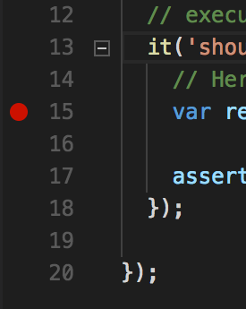
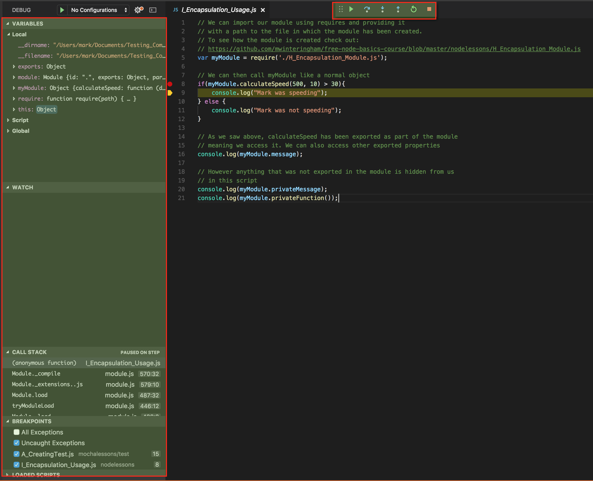

[Course Home](../../course) \| [Official VSCode Docs on Debugging](https://code.visualstudio.com/docs/editor/debugging){:target="_blank"}


No matter how good you get at programming you will have to debug some code within the first few weeks of coding. Then probably every day you code after that.

Debugging is where we add breakpoints into our program, and as our code is being executed it will stop at the breakpoint so we can do some investigation. An example of this would be Selenium WebDriver not clicking a link on your page. You'll run it a few times and it will continue to fail. You'll run it again closely watching it, but eventually, you'll want to debug it.

So from the Terminal window, we'll be able to see at which line the code is failing. We then need to go to that line in the class, and click next to the line number, to the left of the code.



It should add a red dot. This is a breakpoint. So now if we run our test or code in 'debug' mode, our code will stop at this point. You can run debug mode by going to Debug -> Start Debugging

Your code will start like normal, but as soon as it hits your breakpoint, VSCode will come into focus and you'll see you some text around the line of code with the breakpoint, but more importantly, you'll see Debugger window.



I've highlighted the key areas. We'll start with the right hand red rectangle. Here is where you'll see any variables you have in your code, along with their values. This is very useful information, especially if having an issue with test data, or perhaps something is returning as null.

The second red rectangle, top centre, is the controls we have when in debug mode. You can hover over them to see what they are. The main ones I use though are 'step over' and 'step into'. If you press 'step over' it will move to the next line of code. If you press 'step into' will move into the classes of the objects on that line.

So if we had a module called Car, that had a function in it called getNumberOfDoors.

```javascript
module.exports = {

  "getNumberOfDoors" : function(){
    return 4;
  },

}
```

If we then had some code in our test like so:
```javascript
var myModule = require('./car.js');
var numberOfDoors = myModule.getNumberOfDoors();
```

If we were to add a breakpoint to the second line of our test, and ran the test in debug mode, if we pressed 'step into' VSCode would take us to the Car module and into our function.

As mentioned, you'll spend a lot of time debugging, so it's worth exploring and practising with different programs. You all likely have access to someone who can tell you a lot about debugging, they're called Developers!

### [Next Lesson &#10132;](../lessons/intellisense)
