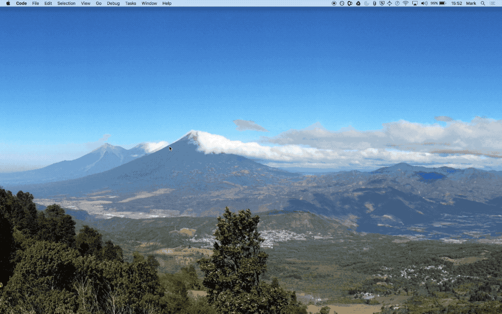
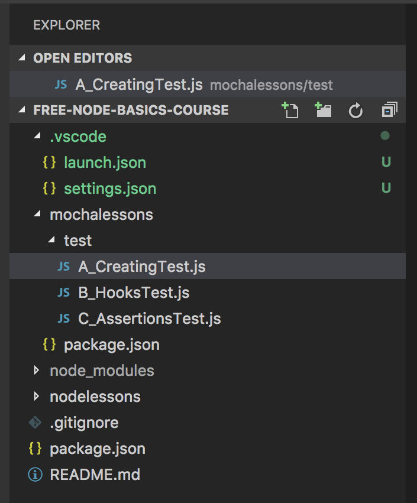
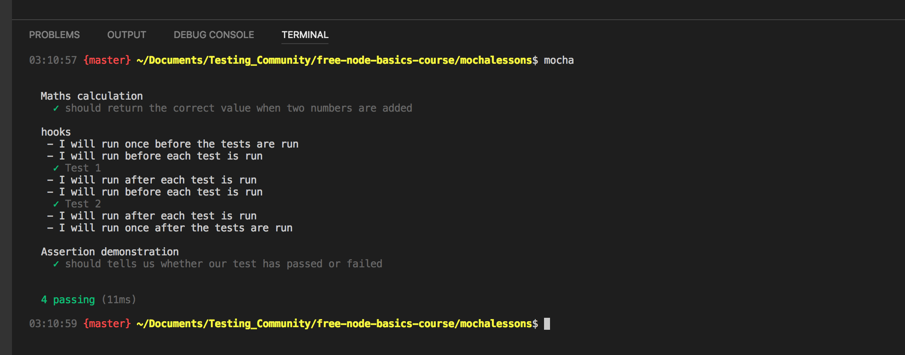

[Course Home](../../course) \| [Official VSCode Docs](https://code.visualstudio.com/docs){:target="_blank"}

There are many Integrated Development Environments (IDEs) to choose from when it comes to developing in Node, but my preference is VSCode.  
VSCode is feature rich, offering lots of little bells and whistles that makes working Node that bit easier. Some of which we look at in this course

### Download and Install VSCode
You can download VSCode from the VSCode [site](https://code.visualstudio.com/download). Once downloaded you can follow the VSCode wizard to see how to install it. There are more details [here](https://code.visualstudio.com/docs/setup/setup-overview) if you require them

### Download and Install Node

To be able to compile and run Node applications and tests you need to have the NodeJS installed on our machine. You can find the latest version of [NodeJS from their site](https://nodejs.org/en/) and you will want to download and install LTS version. Again, follow the instructions in the installation wizard to get setup.

Once installed, quickly test that everything is working by running ```node -v``` and ```npm -v```. If you get a version number back then Node is installed and good to go!

### Downloading code from GitHub
Majority of people who share code online and at workshops tend to store their code in GitHub. So it's certainly a site worth getting familiar with. As is [git](https://git-scm.com/) itself for that matter. Here is a great [online tutorial](https://try.github.io/levels/1/challenges/1) for learning git, claims to take 15 mins.

With regard to my lessons, you just need to go the URL provided with the lesson and click 'Download Zip' from the green button. Then unzip somewhere. All the Node lesson example code can be found at [https://github.com/mwinteringham/free-node-basics-course](https://github.com/mwinteringham/free-node-basics-course) and you

### Importing a Project

Opening a project in VSCode is as simple as going to File -> Open... and locating the root folder of your project and clicking open. Once it's loaded up you will be presented with a new window and an explorer bar as demonstrated below:



### Building a Project
To build the project the easiest way to get setup is to open a terminal or command line window and navigate to the root folder of the project. Once there running ```npm install``` will read the file ```package.json``` file and pull down everything you require to start.

You should see an output similar to this:

```
├─┬ chai@4.1.2
│ ├── assertion-error@1.0.2
│ ├── check-error@1.0.2
│ ├── deep-eql@3.0.1
│ ├── get-func-name@2.0.0
│ ├── pathval@1.1.0
│ └── type-detect@4.0.5
├─┬ mocha@4.0.1
  ├── browser-stdout@1.3.0
  ├── commander@2.11.0
  ├─┬ debug@3.1.0
  │ └── ms@2.0.0
  ├── diff@3.3.1
  ├── escape-string-regexp@1.0.5
  ├─┬ glob@7.1.2
  │ ├── fs.realpath@1.0.0
  │ ├─┬ inflight@1.0.6
  │ │ └── wrappy@1.0.2
  │ ├── inherits@2.0.3
  │ ├─┬ minimatch@3.0.4
  │ │ └─┬ brace-expansion@1.1.8
  │ │   ├── balanced-match@1.0.0
  │ │   └── concat-map@0.0.1
  │ ├── once@1.4.0
  │ └── path-is-absolute@1.0.1
  ├── growl@1.10.3
  ├── he@1.1.1
  ├─┬ mkdirp@0.5.1
  │ └── minimist@0.0.8
  └─┬ supports-color@4.4.0
    └── has-flag@2.0.0
```

### Explorer Window
This is where we navigate our code base, and where we can create new files. If you don't see the Explorer window, you can open it by going to View > Explorer, or by pressing Shift + Cmd/Ctrl + E.



If you right click on a folder, you'll see 'New file' and 'New folder', from there you can add new files to your project.

### Running a Test

Sadly VSCode support for running tests inside the IDE isn't greatly supported. There are plugins available but essentially they run the tests externally from IDE via shortcuts. So to run tests we have to run them in a terminal or command line window. However, VSCode does have an integrated terminal view that we can leverage so we still have everything on one screen. If we go to View -> Integrated Terminal and click you will get something like the image below. From the terminal view we can navigate to our tests, run them and see the output of our tests.



### [Next Lesson &#10132;](../lessons/debugging)
